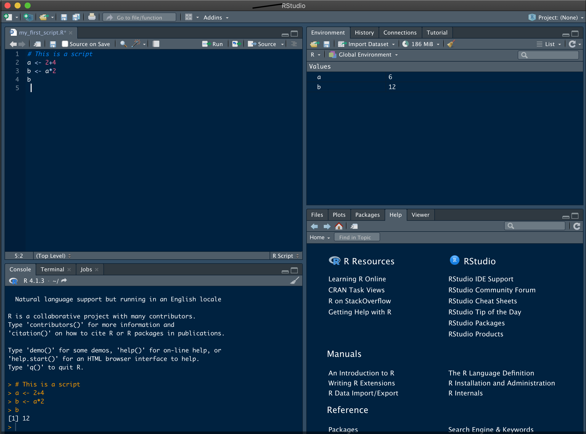

# Installation

## Installing R and RStudio
* You will need to install [R](https://cran.r-project.org/) from its official website.
* Also install [RStudio](https://www.rstudio.com/), one of its IDE (integrated development environment).

You should now have a minimal yet fully working R installation. Most of what follows can directly be done in bare R yet Rstudio brings everything in the same place in a nice, user-friendly and productive environment.

## Introducing RStudio
When you open RStudio, it runs R in the background. At startup you will have four windows :

For now, we will focused on the two on the left column. On top, you will have your "scripting" window, the place to write and save code. Just below, you have the "console" where you can type code directly but also throw lines or full scripts from the window above.

The typical workflow will be to: i) try code in the console, ii) when you're happy with it, save it into your script. This will help you redo whenever and wherever you want your analyses, ie to do some _reproducible_ analyses.

At the console, up and down arrows will navigate through your command history. Ctrl+L will erase the console, not the history. You can also access history through the "History" tab in RStudio.

On the scripting window, Ctrl+Enter will execute the current line, Maj+Ctrl+B will execute every line from the top of your script to the current line. Use these shortcuts from the very beginning of of your journey into R! Moe of them can be found through Rstudio's menu when you access "Keyboard shortcuts help".
